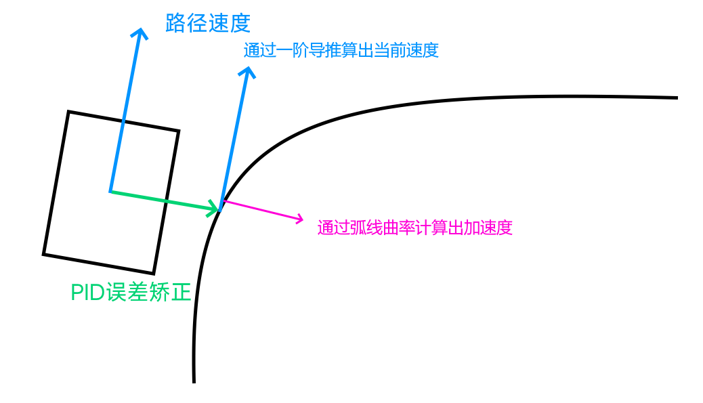

# 程序部分
## 一、从动轮导航系统

#### 基本原理

  
  

- 我们使用了从动轮来感知机器的运动，计算机器的位置、速度、加速度等。
每个从动轮上配有编码器，可以读取从动轮转了多少圈，以此推算出从动轮的位移
- 但是，从动轮的位移并不一定就是机器的位移，机器的旋转也会让从动轮转动，这就会造成误差。我们的解决方案是：

    1. **计算竖直方向位移** 使用对称、平行排列的竖直从动轮求平均值消除机器旋转带来的误差 $$
    \text{竖直平移量} = \frac{\text{右轮移动量} + \text{左轮移动量}}{2}
    $$
    2. **计算旋转** 左右从动轮相减得出旋转量 $$
    \text{旋转量} = (\text{左轮移动量} - \text{右轮移动量}) \times \text{比例k} $$

- 接下来，进行微分/积分就可以得到机器的位置或速度
    1. **计算速度** 对机器平移进行微分
    $$
\mathbf{机器速度} = \left(\frac{d\mathbf{平移量}}{dt}\right)^\text{机器朝向}
$$
    2. **计算平移量** 对机器位移进行路径积分 $$
\text{机器位置} = \int \text{d平移量}^\text{机器朝向}
$$

#### 校准方式

绝大多数队伍在使用从动轮时，需要知道三个轮子之间的确切相对位置，然而，机器在制作时存在公差，并不能保证精确。
所以，我们写了一套校准程序，直接测量机器的读数，并画出回归线，以此测算出正确的参数

## 二、自动阶段路线行走

- 为了使得机器可以在自动阶段精准地完成指令，我们魔改了FRC队伍3015的开源工具Path Planner，对比传统的自动阶段编程，使用pathplanner进行路线设定有以下好处：
  1. 路径由贝塞尔曲线生成，保证机器移动丝滑流畅，且可以通过微调控制点精准控制走线轨迹
  2. 内置物理引擎，即使没有训练场也可以模拟出机器走线过程，甚至可以计算出确切的完成时间。
  3. 用户友好gsui界面，初学者也可以快速编辑自动

- 制定出精确的路径后，我们使用了一套创新的pid算法来控制机器，使其可以精准的跟随路径，具体原理见下图:
$$
    \text{a} = \frac{\text{v}^2 }{\text{r}}
    $$

- 另外，我们的机器在跟随路径时，加入了速度曲线来使过程更加流畅。

   
  

## 三、自动阶段自主决策系统
绝大多数的机器在自动阶段只会执行预设指令，除了一开始的识别导航之外，其余一切动作都是按照设定的路线执行。
而我们在自动程序架构上作了创新，我们的自动程序由若干个命令快组成，每个命令快包含**触发条件、 路径生成函数、终止条件与上层结构指令**构成，详细如下图:

例如，自动阶段导航（放置紫色像素）我们是这样实现的：

除了基础的导航任务，用这套程序架构我们还可以做出很多功能，例如，当我们夹取一个像素堆失败后，机器不会浪费时间去背景板放置，而是会直接夹取下一个像素堆。

## 四、自动瞄准系统
- 在手动阶段，驾驶员自行控制机器接近目标并放置pixel需要很多时间反复微调，还可能出现失误，操作不慎撞上目标。于是，我们设计了一套继集编码器、智能摄像头和TOF距离传感器三种感知方式为一体的自动瞄准系统，实现自主瞄准功能。

- **第一阶段: 自动接近** 当驾驶员按下手柄上的自动瞄准按键，机器会首先通过智能摄像头计算出目标的大概位置。但是，智能摄像头存在延迟、帧率较低、容易丢失目标等问题。所以，这期间底盘会用从动轮编码器感应自身位置，用PID算法移动到目标前面，同时正对目标。
- **第二阶段：自动贴合** 当机器到达目标面前，tof距离传感器启动，感知目标距离；而智能摄像头则负责感应目标的水平偏差。机器会在0.7秒内完成自动贴近目标
- **第三阶段: 微调位置** 当机器完全贴近目标，驾驶员通过手柄选择具体瞄准位置。程序会自动保持与板子的距离（精度 <= 1cm）并调整机器水平位置直到完成瞄准。
- 目前为止我们能够实现三个阶段总共用时**不到4秒**

- **新功能：手臂高度无级调整** 当机器已经完全贴合背板后，手臂可以根据操作手的指令无级调整像素放置高度。操作手只需决定防止高度，程序会自动计算出对应的底盘距离、手臂角度、伸展长度与舵机位置，并实时进行调整

## 五、手动阶段精准控制
- 有了从动轮提供的导航信息，我们建立了一套兼顾灵活、精准、易用的控制系统。这套系统的核心是动态轨迹纠正系统

- 当驾驶员输入移动命令后，系统首先根据自身IMU获取的方向对驾驶员输入进行变换，无论机器朝向，机器的移动方向永远和驾驶员参照系的方向一致。这个功能简称“无头模式”
- 而且，机器在运动途中，从动轮会实时监测机器的实际运动，如果与驾驶员的输入存在误差，会用PID算法进行校正，使机器走一条直线

## 六、程序优化问题
一般来说，ftc机器的程序以单线程运行，机器依次读取传感器、处理程序逻辑、对电机进行控制。
但是当机器有太多功能时，这样做会导致程序延迟过高，于是我们将程序分成三个线程执行，如下所示：
- 优化前

- 优化后

主线程以100次每秒读取手柄并处理程序逻辑；马达控制线程以100次每秒控制电机；传感器通讯线程受到rev控制板自身硬件性能限制，只能以40次每秒读取传感器
在这种情况下，我们成功将操作延迟从50ms降低至10ms，并将PID的更新速率从20次每秒提升至40次每秒，大大提升了机器的流畅度
