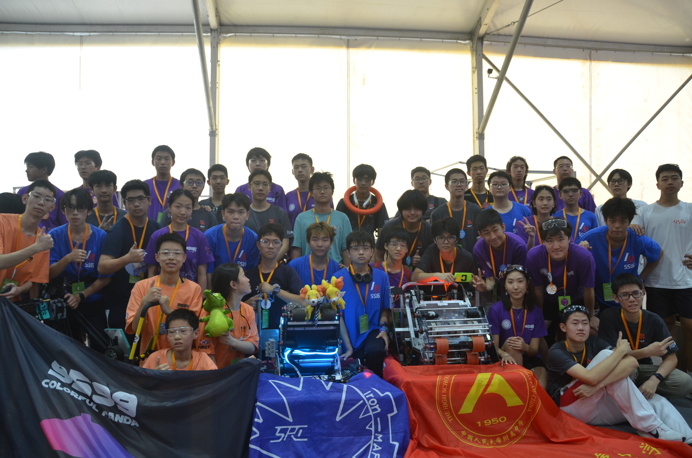
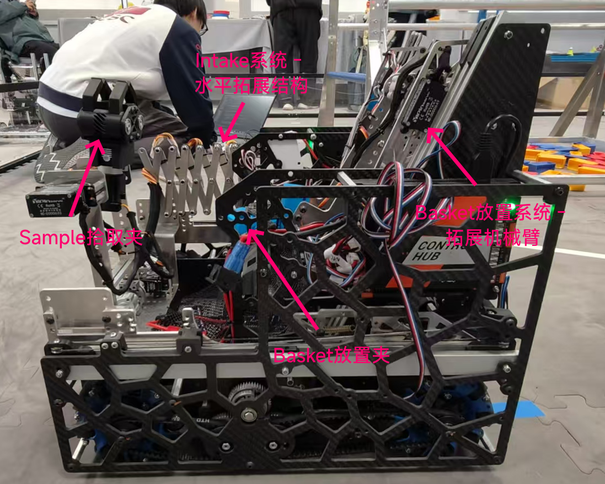
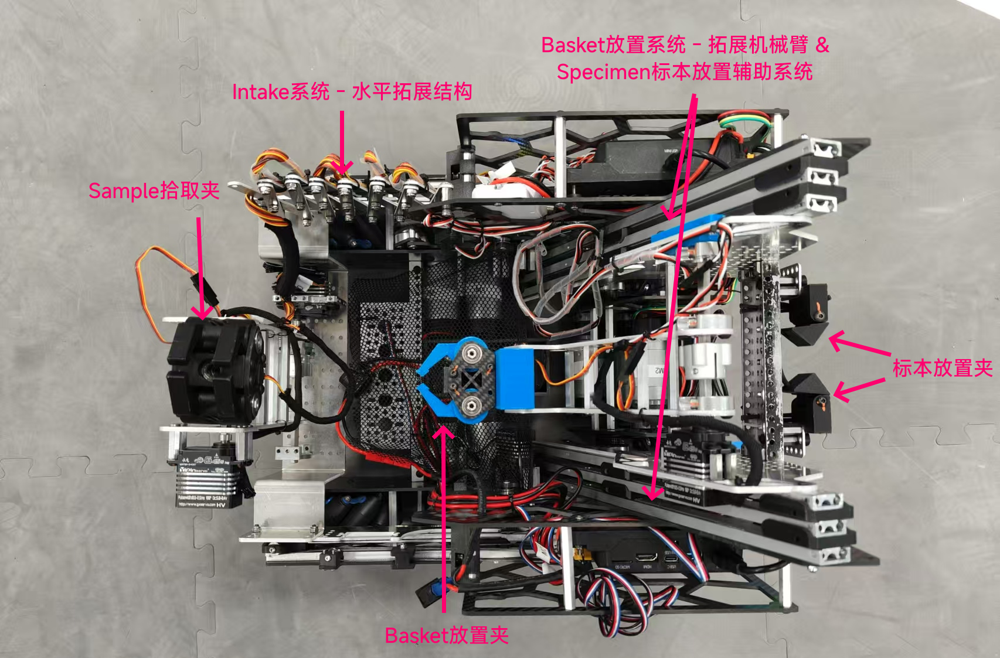
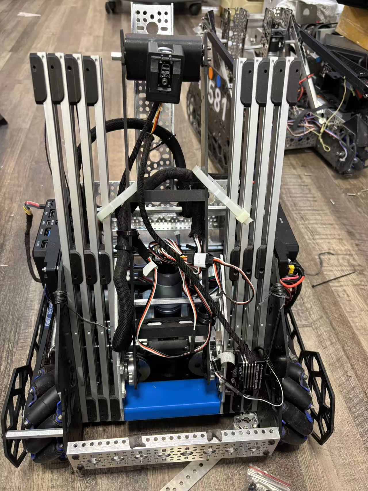
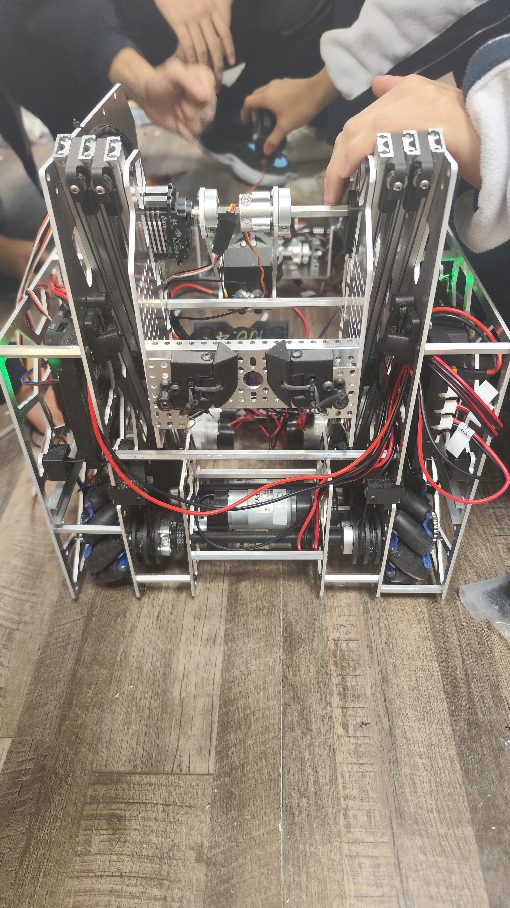
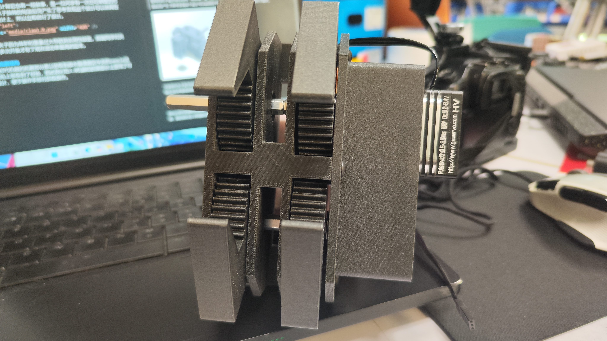
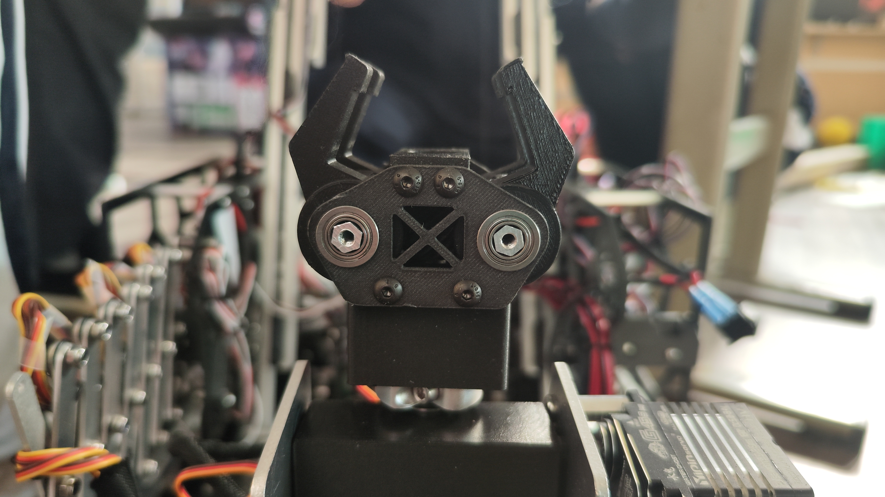
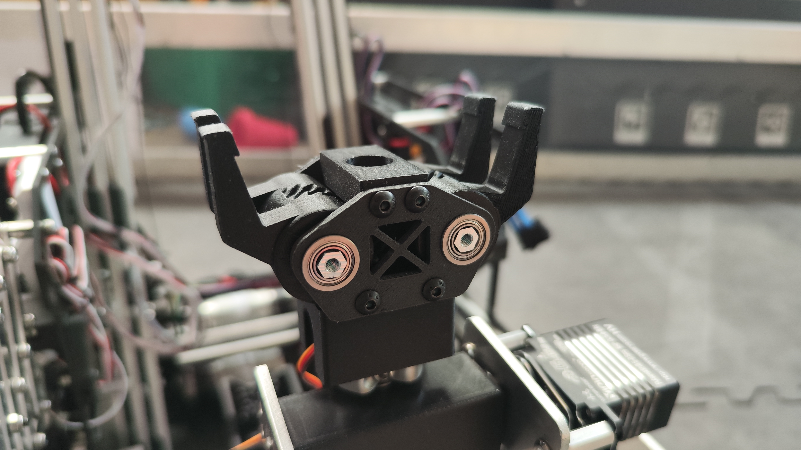
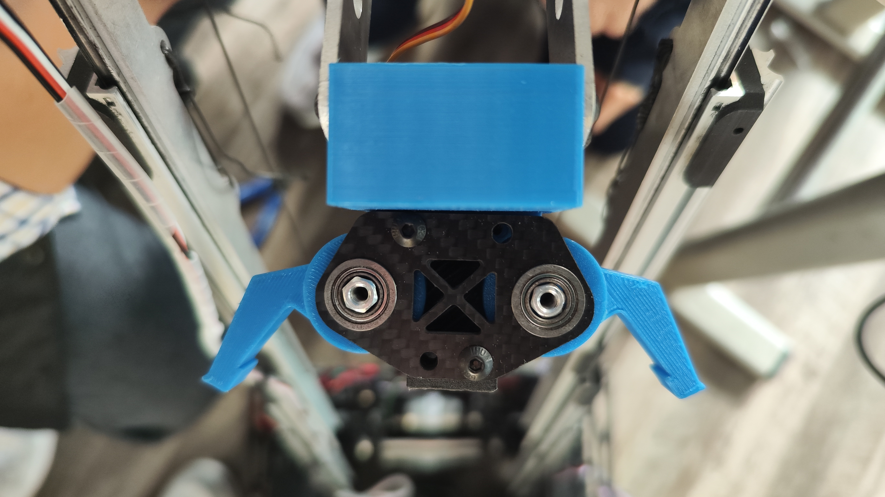

# 关于我们

我们是IRON MAPLE #19580, 来自深圳南山（中加）学校。我们此次参加比赛的团队是由 15 名校内机器人社团的成员组成，其中有三分之二的成员为本年度9月份新加入队伍的高一社员。此次比赛，作为一只充满了许多“新鲜的花蕊”的青训队伍，本队其中一大目标在于让新队员能够熟悉比赛现场，在老队员的一步步指导下，获取经验，磨练队伍之间的配合能力，让这些花蕊们能够在此后长为成熟的花朵，成为队伍的顶梁柱。

过去的几个月内，我们一直与同校队伍19581一起合作，优化参赛的机器，让机器以及赛事伴随着我们的成长不断进步。与此同时，组件这只新的队伍，代表着我们的规模正在扩大，影响力也在不断壮大，我们希望藉此，通过行动及努力，依靠着向更多的人推广FIRST®, 并以自己的方式为FTC 做出贡献，这也是我们今年度无论在FTC赛事上还是FRC赛事上的主要目标。

# 机器完成图

  
  

# 工程部分

## 一、遇到的主要困难，以及对其的优化

  

第一代机器

初代机器在经过大量测试后发现，因为其拓展部分重量过重导致机器手臂处的舵机承受不了其重量，大多数手臂处的舵机在正常工作3天内会有不同程度上的损坏。因此经过大家一致决定下我们对机器进行了重新设计，便有了现在的2.0版本。

第二代机器

## 二、经济性
由于19580为由高一的新队员组成的青训队，因此首要的研究点之一便在于如何使用较少的资源制作出最强力的机器，即如何顺利地“降本增效”。本次比赛进行准备的过程，以及比赛时，我们会以19580的这一经济性研究作为先导，为后续比赛改善19581的经济性以及机器综合效能做前期铺垫。因此，为了节约成本，其中一项行动便是我们放弃一贯追求的以碳板为主的设计，转而使用更为经济实惠的铝材，并与具有足够强度的PETG或PETG-CF为打印材料的3d打印件相配合。

## 三、底盘

我们在机器装上了麦克纳姆轮，使机器可以更加灵活。然而，由于麦克纳姆轮会导致一些不精确，所以我们在机器的底部还加装了3个从动轮的结构，来弥补麦克纳姆轮的缺点。

  

## 四、夹子结构

### 1.Sample拾取夹
独特的爪子设计背后也有一段轶事，是一位同学有一次在吃螃蟹的时候看到螃蟹爪子独特的构造后而产生了思考发现这个设计可以运用在FTC的爪子设计上，所以立即进行了设计。

   
  

可是初代夹子因为体积和重量过大导致其实用性较低，后期同学对夹子进行了多次升级，着重缩小了体积，减轻了重量，才有了现在成功率最高的版本。 

 

### 2.Basket放置夹

大角度对结构进行旋转，以单一夹子完成所有任务的形式是我们最初的想法，然而舵机只能调试结构，例如伸缩杆的转动度数，所以在机器的夹子很大几率会一下子摔到另一个结构上，使得其他结构以及夹子本身受到很大的冲击力，显然这种设计会使得舵机以及整体结构的寿命变得很低。因此我们参考了Sample拾取夹的设计进行针对性改良，删减掉原本的大角度反转设计，利用单独的一个单层夹，既增强了可靠性也进一步降低了重量。

由此，一套多夹系统诞生，我们通过较上层的夹子夹取Sample，然后将其交接给较下层的Basket放置夹，完成接力，让操作手无需花费时间与精力考虑机器的旋转便可得分。

 

## 四、机械臂拓展

### 1.Intake系统
我们从初代机器的拓展部分难以拾取到潜水器请器区中央的Sample这一个缺陷上吸取到了经验，因此我们在2.0机器的拓展部分上使用了可伸缩设计，便于操作手经行抓取操作。 

  
  

### 2.Basket放置系统

我们同样为Basket放置系统设计了一套拓展结构，两个可伸缩长杆导轨为结构的主要构成，该设计参考了去年FTC CENTERSTAGE中同校队伍19581放置Pixel的机械臂，因此设计十分成熟。此伸缩结构可以自如收放，还能确保在无法完成高篮子放置任务时可以随时将Sample放置在低篮位。

 

### 3.Specimen标本放置系统

值得一提的是，我们在伸缩结构的背面，制作了一个十分巧妙的系统。这个结构使得我们的机器可以通过放置specimen得分，但又无需加装任何舵机，我们仅仅使用皮筋和几个3D打印件，便成功实现了这一功能，使得机器既能多一种得分方式，又能够更加得节省电池电耗，提升经济性，这也体现了本队在组建时的一大目标。