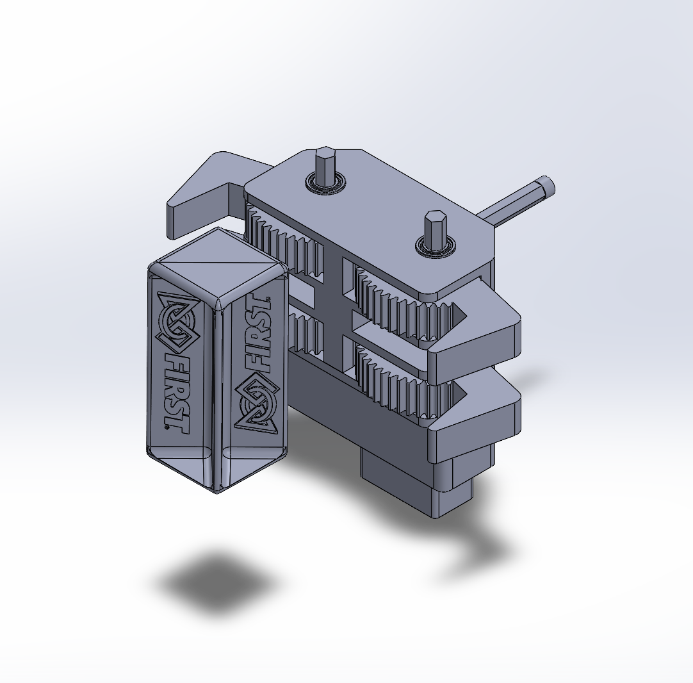

# 工程部分
## 一、机器整体开发及优化

  
  

初代机器在经过大量测试后发现，因为其拓展部分重量过重导致机器手臂处的舵机承受不了其重量，大多数手臂处的舵机在正常工作3天内会有不同程度上的损坏。因此经过大家一致决定下我们对机器进行了重新设计，便有了现在的2.0版本。
## 2.经济高效
因为19580是主要由高一同学组成的，因此如何使用较少的资源制作出最强力的机器是同学们首先要思考的。为了节约成本，我们放弃一贯追求的以碳板为主的设计，转而使用更为经济实惠的铝材。

## 3.拾取结构
独特的爪子设计背后也有一段轶事，是一位同学有一次在吃螃蟹的时候看到螃蟹爪子独特的构造后而产生了思考发现这个设计可以运用在FTC的爪子设计上，所以立即进行了设计。

   

可是初代夹子因为体积和重量过大导致其实用性较低，后期同学对夹子进行了多次升级才有了现在成功率最高的版本。  

## 4. 拓展结构
我们从初代机器的拓展部分难以拾取到潜水器请器区中央的Sample这一个缺陷上吸取到了经验，因此我们在2.0机器的拓展部分上使用了可伸缩设计，便于操作手经行抓取操作。 

